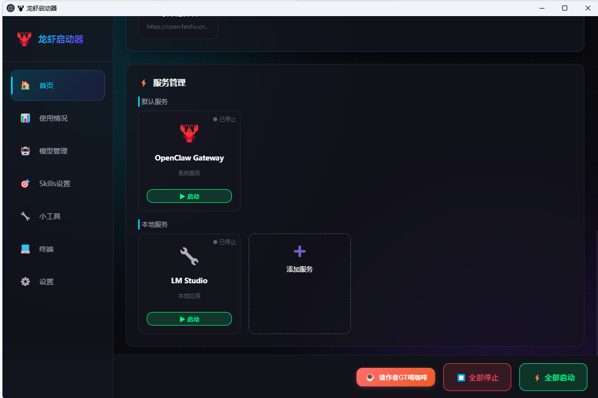
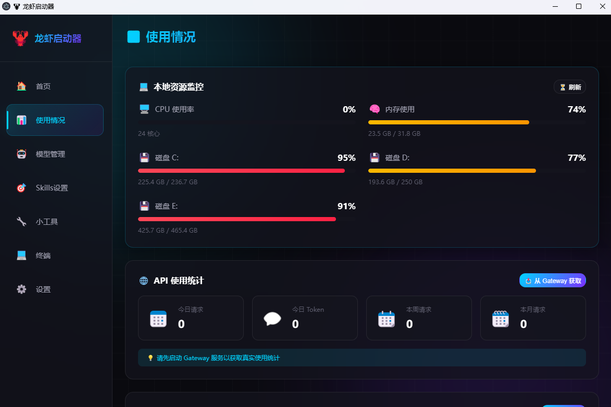
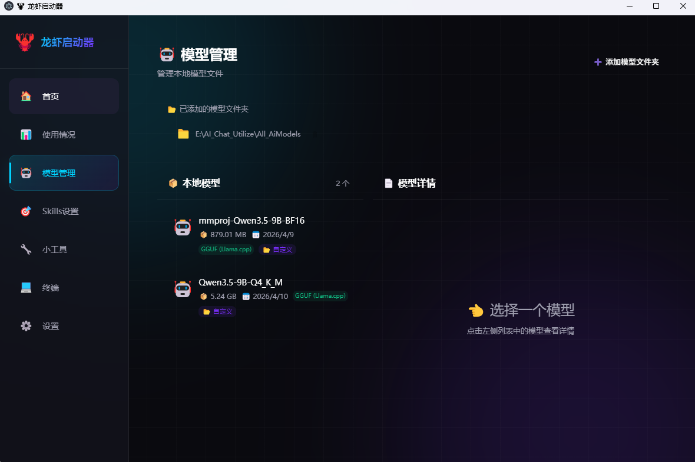
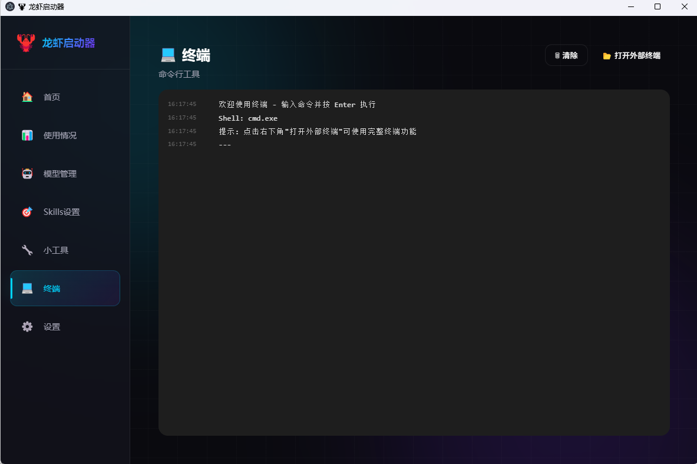

# 🦞 龙虾启动器 · 功能说明文档

---

## 1. 🏠 仪表盘（首页）

**核心功能：**
- **智能检测** — 自动检测 OpenClaw 安装路径
- **凭证管理** — 一键复制 Gateway URL、Token 和密码
- **快捷访问** — 快速访问重要文件和文件夹

**添加文件夹快捷方式：**
点击「添加」→ 上传图标（可选）→ 输入文件夹名称 → 浏览选择路径 → 确认添加

---

## 2. ⚡ 服务管理

**核心功能：**
- **Gateway 控制** — 一键启动/停止 OpenClaw Gateway
- **本地模型服务** — 管理 LM Studio、Ollama 等本地 AI 服务
- **批量操作** — 一键启动/停止所有服务

**添加服务：**
点击「添加服务」→ 浏览选择启动文件（`.exe` 或 `.bat`）→ 确认

---

## 3. 📊 使用统计

**核心功能：**
- **API 用量** — 追踪 Token 消耗和 API 调用
- **本地资源** — 监控 CPU、内存、GPU 使用情况

---

## 4. 🤖 本地模型管理

**核心功能：**
- 点击「添加模型文件夹」→ 选择路径 → 确认
- 系统自动识别本地模型文件并导入管理

---

## 5. 🎯 Skills 管理

**核心功能：**
- **配置管理** — 创建、编辑、删除 Skills 配置方案
- **快速切换** — 一键切换不同配置方案（联网模式/本地模式）
- **黑名单/白名单** — 精细化控制 Skills 启用/禁用

**为什么需要 Skills 管理？**
OpenClaw 等 Agent 启动时会全量扫描所有 Skills，导致 Token 开销过大。通过黑名单机制屏蔽不常用的 Skills，可以显著降低每次对话的系统提示长度。

**操作步骤：**
1. 点击「导入 Skills」→ 浏览选择 Skills 文件夹
2. 选择不需要的 Skill → 添加到黑名单
3. 选择模型来源（本地/远程）
4. 保存默认配置

---

## 6. 🔧 小工具

**核心功能：**
- 注册常用脚本或工具为快捷按钮
- 支持选择是否在新终端中运行

**添加工具：**
点击「添加工具」→ 输入名称 → 选择脚本路径 → 设置运行方式 → 确认

---

## 7. 💻 终端

内置终端模拟器，可直接执行命令行操作。支持打开外部终端。

---

## 8. ⚙️ 设置

全局配置中心，包含应用偏好、路径配置等。

