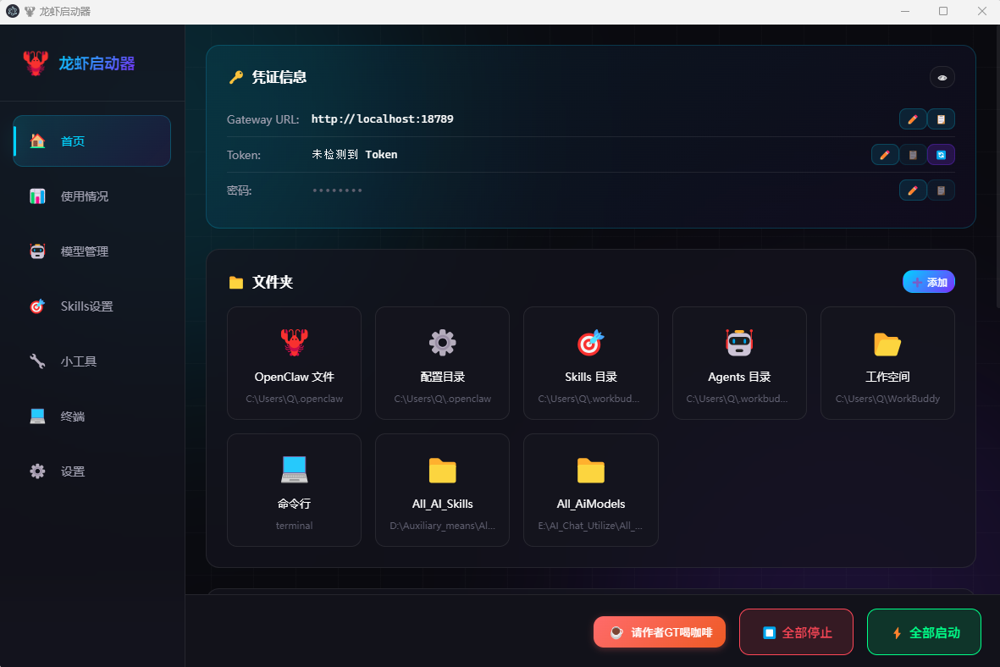
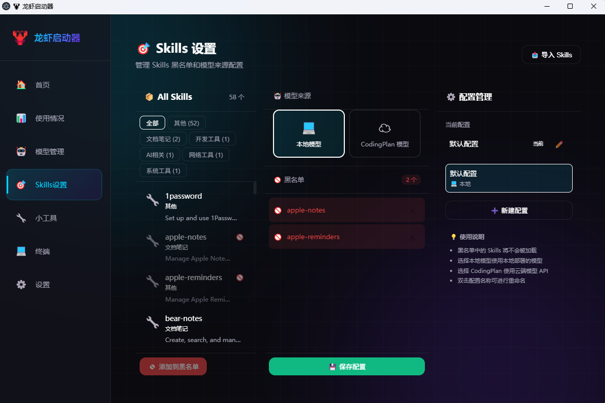
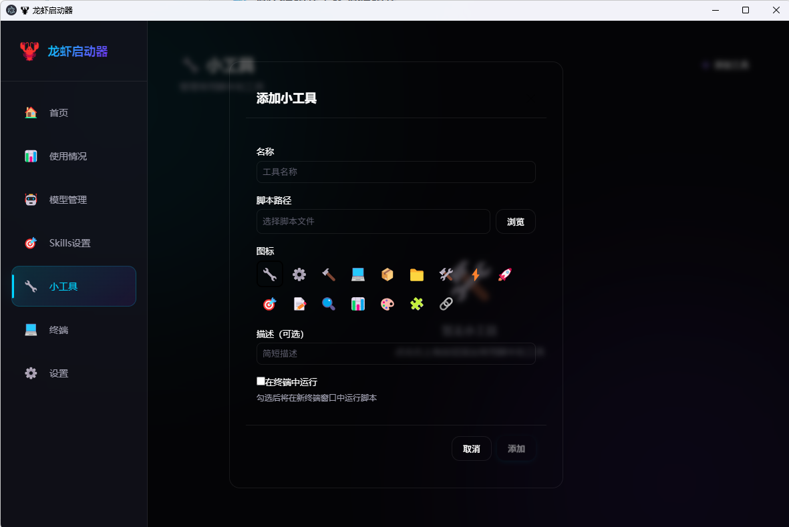
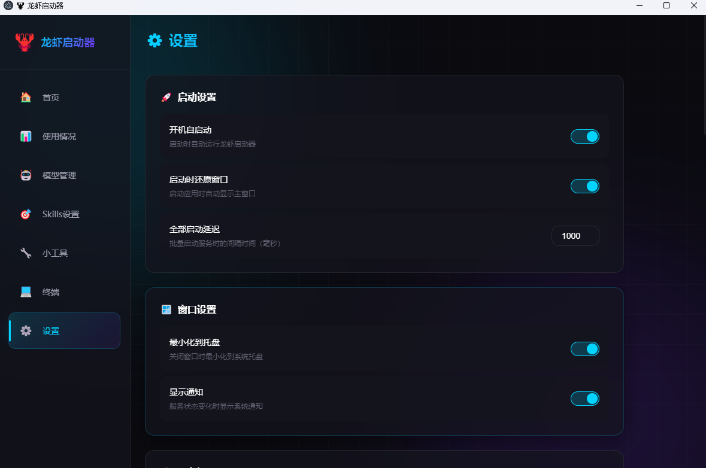

# 🦞 LobsterLauncher · 龙虾启动器

<p align="center">
  <strong>专为 OpenClaw 用户打造的桌面管理工具</strong><br>
  <em>A powerful desktop launcher for OpenClaw users</em>
</p>

<p align="center">
  <a href="#功能特点">功能</a> •
  <a href="#界面预览">预览</a> •
  <a href="#快速上手">安装</a> •
  <a href="#使用指南">使用</a> •
  <a href="#技术栈">技术</a>
</p>

---

## ✨ 功能特点

| 模块 | 说明 |
|:-----|:-----|
| 🏠 **仪表盘** | 自动检测 OpenClaw 路径、一键复制凭证、快捷访问文件 |
| ⚡ **服务管理** | 一键启停 Gateway / LM Studio / Ollama 等服务，支持批量操作 |
| 📊 **使用统计** | 追踪 API Token 消耗、监控 CPU/内存/GPU |
| 🤖 **模型管理** | 扫描本地模型文件夹，自动识别并统一管理 |
| 🎯 **Skills 管理** | 黑名单/白名单控制，减少无效 Token 扫描开销 |
| 🔧 **小工具** | 自定义脚本快捷运行，可选新终端执行 |
| 💻 **终端** | 内置命令行工具，支持外部终端打开 |
| ⚙️ **设置** | 全局配置中心 |

---

## 🖼️ 界面预览

### 1. 仪表盘 — 首页

智能检测 OpenClaw 安装路径，集中展示 Gateway URL、Token 和密码，一键复制。底部可添加常用文件夹快捷入口。

<div align="center">
  
</div>

---

### 2. 服务管理

管理所有 AI 相关服务——OpenClaw Gateway、LM Studio、Ollama 等。支持单个启停和批量操作。

> 操作方式：点击「添加服务」→ 浏览选择 `.exe` 或 `.bat` 文件即可注册。

<div align="center">
  
</div>

---

### 3. 使用统计

实时追踪 API 调用量与 Token 消耗，同时监控本机 CPU、内存、GPU 占用情况。

<div align="center">
  
</div>

---

### 4. 本地模型管理

点击「添加模型文件夹」后，系统自动扫描识别本地模型文件（GGUF 等），统一纳入管理面板。

<div align="center">
  
</div>

---

### 5. Skills 管理

**解决痛点：** OpenClaw 等 Agent 启动时会全量扫描所有 Skills，导致 Token 开销过大。

通过黑名单机制屏蔽不常用的 Skills，显著降低每次对话的系统提示长度：

> 导入 Skills 目录 → 选择需屏蔽的 Skill 加入黑名单 → 选择模型来源（本地/远程）→ 保存默认配置

<div align="center">
  
</div>

---

### 6. 小工具

将常用脚本或工具注册为快捷按钮，支持选择是否在新终端窗口中运行。

<div align="center">
  
</div>

---

### 7. 终端

内置终端模拟器，可直接执行命令行操作。也可点击「打开外部终端」调用系统终端。

<div align="center">
  
</div>

---

### 8. 设置

全局配置中心，包含应用偏好、路径配置等选项。

<div align="center">
  
</div>

---

## 🚀 快速上手

### 下载安装

前往 [Releases](https://github.com/mornikar/OpenClaw_Launcher_LobsterLauncher/releases) 页面获取最新版本。

| 平台 | 文件 |
|:-----|:-----|
| Windows 安装版 | `LobsterLauncher-Setup.exe` |
| Windows 便携版 | `LobsterLauncher-Portable.zip` |

### 从源码构建

```bash
# 克隆仓库
git clone https://github.com/mornikar/OpenClaw_Launcher_LobsterLauncher.git
cd OpenClaw_Launcher_LobsterLauncher

# 安装依赖
npm install

# 开发模式运行
npm run dev

# 生产构建
npm run build
```

**前置要求：** Node.js ≥ 18 · npm ≥ 9 · Git

---

## 📖 使用指南

### 首次启动

1. 运行程序，应用自动检测 OpenClaw 安装路径
2. 在首页确认 Gateway URL 和 Token 显示正常
3. （可选）在服务管理中添加常用服务
4. 开始使用！

### 服务管理

1. 进入 **首页 → 服务管理** 区域
2. 点击 **+ 添加服务** → 浏览选择启动文件（`.exe` / `.bat`）
3. 单个服务右键操作，或使用底部 **全部启动 / 全部停止** 按钮

### Skills 黑名单配置

1. 进入左侧导航 **Skills 设置**
2. 点击 **导入 Skills** → 选择 Skills 文件夹路径
3. 勾选不需要的 Skill → 点击 **添加到黑名单**
4. 选择当前使用的 **模型来源**（本地 / 远程）
5. 点击 **保存默认配置**

---

## 🛠️ 技术栈

| 层级 | 技术 |
|:-----|:-----|
| 框架 | Electron |
| 前端 | Vue 3 + Vite |
| UI 风格 | 科技感暗色主题 + Glassmorphism |
| 终端 | node-pty + xterm.js |
| 系统监控 | systeminformation |
| 数据存储 | electron-store |
| 打包 | electron-builder |

---

## 📁 项目结构

```
LobsterLauncher/
├── src/
│   ├── main/                 # Electron 主进程
│   ├── preload/              # IPC 桥接脚本
│   └── renderer/             # Vue 3 前端
│       ├── components/       # 组件
│       ├── pages/            # 页面
│       └── assets/           # 样式与资源
├── .github/images/           # 文档配图
├── data/                     # 运行时数据
├── SPEC.md                   # 功能规格说明
└── CHANGELOG.md              # 版本历史
```

---

## 📊 数据存储

```
Windows: %APPDATA%/LobsterLauncher/
├── config.json          # 应用配置
├── services.json        # 服务列表
├── skills-config.json   # Skills 配置
└── models-config.json   # 模型配置
```

### OpenClaw 路径自动检测顺序

1. `%OPENCLAW_HOME%` 环境变量
2. `%USERPROFILE%\.openclaw`
3. `%APPDATA%\openclaw`
4. `%LOCALAPPDATA%\openclaw`
5. `C:\Program Files\OpenClaw`
6. `D:\Program Files\OpenClaw`

---

## 🤝 参与贡献

Issue 和 PR 均欢迎！

```bash
# Fork → 创建分支 → 提交 → 推送 → 创建 PR
git checkout -b feature/amazing-feature
git commit -m 'Add some amazing feature'
git push origin feature/amazing-feature
```

---

## 📄 许可证

[MIT](LICENSE)

---

## 🙏 致谢

- [OpenClaw](https://openclaw.ai) — AI Agent 平台
- [Electron](https://electronjs.org) — 跨平台桌面框架
- [Vue.js](https://vuejs.org) — 渐进式 JavaScript 框架

---

<p align="center">
  <strong>Made with ❤️ for OpenClaw users</strong><br>
  <em>为 OpenClaw 用户用心打造</em>
</p>
